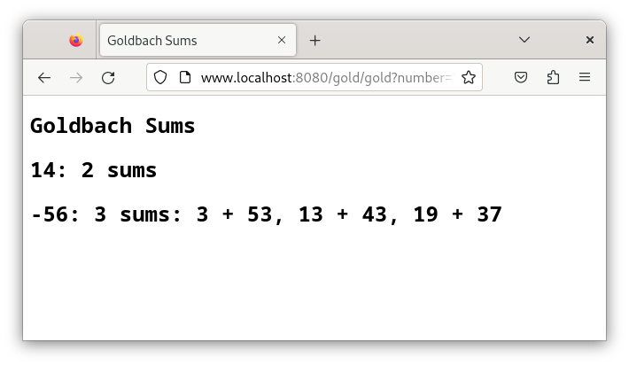
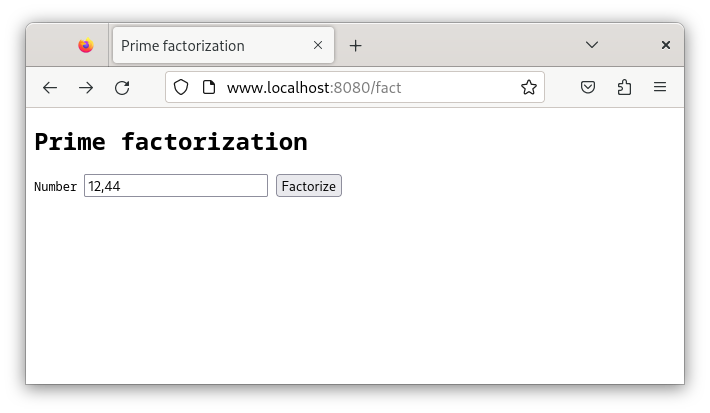
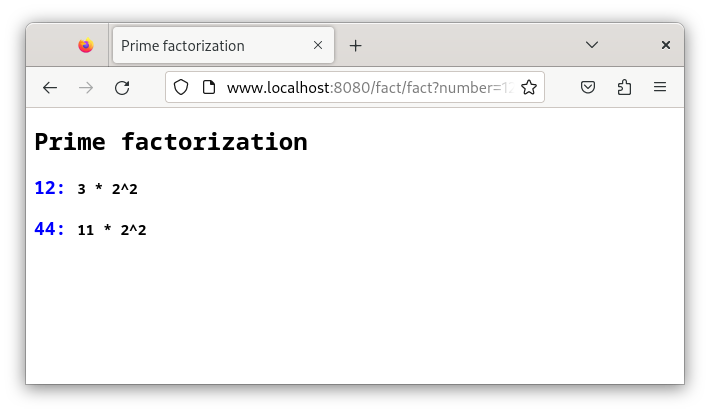
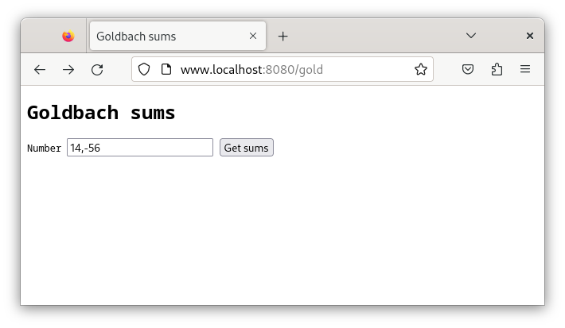

# Análisis del proyecto

## Introducción
El propósito principal del presente documento es analizar y plantear la conversión de un servidor serializado a un servidor concurrente, como parte del proyecto del curso CI-0117 - Programación Paralela y Concurrente de la Universidad de Costa Rica. En este proyecto, nos proponemos transformar un servidor que maneja conexiones de manera secuencial en uno que pueda gestionar múltiples conexiones concurrentemente, mejorando así su eficiencia y capacidad de respuesta. El servidor estará destinado a proporcionar dos servicios principales a los usuarios: factorización prima de números y sumas de Goldbach. Ambos servicios serán accesibles a través de conexiones serializadas, lo que permitirá a los clientes enviar solicitudes al servidor y recibir respuestas de manera eficiente. El proyecto ha sido llevado a cabo por un equipo de tres personas, quienes hemos trabajado en conjunto para diseñar, implementar y probar la solución propuesta. En este documento, se detallarán los requisitos del sistema, los casos de uso, el diseño de la arquitectura del servidor concurrente y las pruebas planificadas para garantizar el correcto funcionamiento del mismo.  

## Descripción del Problema
El proyecto consiste en la implementación de un servidor web concurrente que brinde a sus usuarios la posibilidad de ingresar una secuencia de números enteros y obtener la factorización prima y/o las sumas de Goldbach de dichos números. Es importante destacar que, para recopilar los requerimientos del proyecto, en lugar de realizar entrevistas a los clientes, se aprovechó una base de código existente. Esta base de código proporciona un servidor web serializado, complementado con un documento explicativo que detalla los objetivos y expectativas del proyecto y una serie de grabaciones de inducción para comprender el código heredado.  
## Requisitos
Los requisitos funcionales describen las acciones específicas que el sistema debe considerar, mientras que los requisitos no funcionales se refieren a atributos del sistema.  

Los requisitos funcionales identificados son:  
  • Debe poder aceptar dos parámetros  
    - Uno es el puerto en el que el servidor web esperará por conexiones de clientes. Si se omite, podrá asumir el puerto 8080.  
    - El otro indicará el número máximo de conexiones de clientes que debe permitir de 	manera concurrente. Si se omite éste, deberá asumir tantos como núcleos tenga 	disponibles la máquina donde corre el servidor.  
  • Servicio de factorización prima  
	  - El servidor debe ser capaz de recibir solicitudes de factorización prima de números 	enteros.  
	  - Debe procesar las solicitudes recibidas y devolver la factorización prima de cada 	número.  
	  - El servidor debe ser capaz de manejar múltiples solicitudes de factorización 	simultáneamente.  
	  - La aplicación de factorización debe estar implementada en el paradigma de 	programación orientada a objetos.  
  • Servicio de sumas de Goldbach  
	  - El servidor debe ser capaz de recibir solicitudes de sumas de Goldbach de números 	enteros positivos y negativos. De los números positivos, debe devolver cuántas sumas 	encontró y de los negativos, además de cuántas sumas encontró deberá devolver 	explícitamente cuáles son esas 	sumas.  
 	  - El servidor debe manejar múltiples solicitudes de sumas de Goldbach de forma 	concurrente.  
	  - La aplicación de sumas de Goldbach debe estar implementada en el paradigma de 	programación orientada a objetos.
  • Conexiones concurrentes  
	  - El servidor debe ser capaz de manejar múltiples conexiones concurrentes de clientes.  
	  - Debe asignar recursos de manera eficiente para manejar las solicitudes de los clientes 	de manera concurrente sin bloquear el servidor.  
	  - Debe admitir a los clientes para acceder a los servicios de factorización prima y sumas 	de Goldbach.  
  • Manejo de errores  
	  - El servidor debe ser robusto y capaz de manejar errores de manera adecuada, 	proporcionando mensajes de error claros y manejando situaciones inesperadas de 	manera elegante.  
 	  - Números mal formados, fuera de rango, o entradas mal intencionadas serán 	reportadas con mensajes de error en la página web resultado, en lugar de caerse o 	producir resultados con números incorrectos.  
  • Interfaz de usuario  
	  - Debe incluirse una interfaz de usuario para que los usuarios ingresen los números y 	vean los resultados de la factorización prima y las sumas de Goldbach de manera clara	y ordenada.  
  • Finalizar el servidor  
    - Al finalizar el servidor (con CTRL+C o el comando ` Kill` ), éste debe reaccionar a la señal y hacer la limpieza debida, deteniendo las conexiones, avisar a los hilos que terminen y liberar la memoria utilizada.  

Los requisitos no funcionales son:  
  • Rendimiento  
	  - El servidor debe ser capaz de manejar una carga de trabajo significativa sin mucha 	degradación del rendimiento.
	  - El tiempo de respuesta para las solicitudes de los clientes debe ser rápido y predecible.  
  • Disponibilidad  
	  - El servidor debe estar disponible y accesible para los usuarios sin interrupción hasta 	que éste lo cierre.  
  • Seguridad  
	  - El servidor debe implementar medidas para protegerse de datos excesivamente 	grandes o mal intencionados que intenten degradarlo o bloquearlo.  
  • Fiabilidad  
	  - El servidor debe ser confiable y consistente en su comportamiento, evitando fallas 	inesperadas o comportamientos erráticos.  
	  - Debe ser capaz de manejar correctamente situaciones de error y recuperarse de 	manera elegante.  
  • Mantenibilidad  
	  - El código del servidor debe ser fácil de entender, modificar y mantener.  
	  - Debe seguir buenas prácticas de programación y diseño para facilitar la colaboración 	entre desarrolladores y futuras actualizaciones del sistema.  
  • Usabilidad  
	  - La interfaz de usuario debe ser intuitiva y fácil de usar para los usuarios finales.  
  • Compatibilidad  
	  - El servidor debe ser compatible con diferentes navegadores web y dispositivos de 	clientes.  

## Solución Propuesta
El proyecto implementa un servidor web que maneja solicitudes HTTP concurrentes usando hilos y una cola de sockets. La clase principal, HttpConnectionHandler, gestiona las conexiones entrantes en hilos separados, mientras que las WebApps como FactWebApp y GoldWebApp procesan solicitudes específicas. La lógica de enrutamiento dirige cada solicitud a la aplicación adecuada según su URI. Esta combinación garantiza un rendimiento óptimo al manejar múltiples solicitudes simultáneamente y ofrecer funcionalidades específicas a los clientes.
[Explicacion completa](./design/readme.md)

## Manual del usuario
### I. Cómo compilar el programa

Para compilar el programa, siga los pasos indicados a continuación desde la terminal de Linux, asegurándose de estar ubicado en la carpeta raíz del proyecto:

  - 1º. Ejecute el comando `make clean` . Esto eliminará las carpetas bin/, build/ y doc/, limpiando el entorno de compilación previo.</li> 
  - 2º. A continuación, ejecute el comando ` make` . Este comando compila y vincula los componentes localizados en la subcarpeta src/. Una vez finalizado, el ejecutable se almacenará en la subcarpeta bin/ y llevará el mismo nombre que la carpeta raíz del proyecto.  

Las instrucciones necesarias para ejecutar estos comandos están definidas en el archivo Makefile, el cual se encuentra en la carpeta raíz del proyecto.   

### II. Qué es y para qué sirve un Makefile
Este archivo es fundamental para la automatización del proceso de compilación y se estructura de la siguiente manera:
Componentes clave de un Makefile:  
  • Reglas: Cada regla específica cómo construir un objetivo, ya sea un archivo ejecutable o un objeto, a partir de uno o más archivos fuente. También pueden incluir acciones adicionales como eliminar archivos temporales o instalar el programa.  
  • Dependencias: Identifican los archivos que deben existir y estar actualizados para que la regla correspondiente pueda ejecutarse. Estas dependencias son esenciales para determinar qué componentes del proyecto necesitan ser recompilados tras cambios en los archivos.  
  • Comandos: Corresponden a las instrucciones de shell que se ejecutan para construir los objetivos. Estos pueden incluir la compilación de código fuente, la vinculación de objetos, y otras tareas relacionadas.  
  • Variables: Permiten definir y ajustar parámetros como los compiladores y las banderas de compilación, facilitando la configuración y adaptación del proceso de compilación.  
Funciones de un Makefile:  
  • Automatización: Optimiza el proceso de compilación asegurando que solo los componentes modificados sean recompilados, lo cual es crucial en proyectos grandes.  
  • Eficiencia: Minimiza el tiempo de desarrollo al limitar la compilación a los elementos que realmente necesitan actualización, evitando procesos innecesarios.  
  • Organización: Mejora la gestión del proyecto al proporcionar un conjunto claro y estructurado de instrucciones de compilación, lo que facilita la colaboración en equipos de desarrollo.  
Este enfoque asegura una metodología eficiente y organizada para la compilación de proyectos, adaptándose tanto a necesidades individuales como colectivas en el entorno de desarrollo.   

### III. Ejecutar el programa
Para ejecutar el programa desde lnea de comandos de linux, simplemente ingrese su nombre (sin extensión), añadiendo dos valores enteros positivos como parámetros. Si ejecuta el programa desde un directorio diferente, deberá especificar la ruta completa hasta el ejecutable. El primer parámetro determina el puerto en el que el servidor estará "escuchando" conexiones. El segundo define el número de hilos de ejecución que se utilizarán en el servidor. Estos parámetros son opcionales; si no se proporcionan, el sistema asumirá el puerto 8080 y el número de hilos equivalente al número de procesadores físicos disponibles en la computadora.  
Por ejemplo, supongamos que el ejecutable se llama proyecto1, para iniciarlo con un puerto específico y un número determinado de hilos, desde la carpeta raiz escriba:  
<pre>
./bin/proyecto1.1:8080 4
</pre>
Una vez que el servidor esté activo y "escuchando", los usuarios pueden interactuar con él mediante un navegador web. Para acceder a las aplicaciones disponibles, deben escribir la siguiente dirección en la barra de direcciones del navegador:  
    • Para la factorización prima: Ingrese ` www.localhost:8080/fact` . Se mostrará una pantalla donde deberá introducir uno o más valores enteros, separados por comas o espacios, en el campo denominado number.  
     
Después de hacer clic en el botón ` Factorizar` , los resultados se mostrarán en la misma página.  
     
    • Para las sumas de Goldbach: Ingrese ` www.localhost:8080/gold` . Aparecerá una pantalla similar en la que deberá introducir uno o más valores enteros, sean negativos o positivos, separados por comas o espacios, en el campo Number.  
     
Al hacer clic en el botón ` Get sums` , los resultados aparecerán en el navegador. El tiempo de respuesta variará dependiendo del tamaño de los números ingresados. Durante este proceso, se mostrará un indicador animado en la pestaña del navegador, señalando que el cálculo está en curso.  
     
Este método permite una interacción clara y efectiva con el servidor a través de interfaces sencillas y funciones específicas para cada tipo de cálculo requerido.  
### IV. Finalizar el servidor  
Para finalizar el servidor, existen dos métodos eficaces. El primero es a través de la terminal en la que se inició el servidor, donde también se reciben los mensajes de diagnóstico de su actividad. Simplemente, pulse Ctrl+C, combinando simultáneamente las teclas Control y C. El segundo método requiere determinar previamente el ID del proceso del servidor, que generalmente corresponde al nombre del ejecutable. Una vez que tenga este dato, desde otra terminal, ejecute el comando ` kill <pid>` , sustituyendo \<pid\> por el número de proceso que haya consultado.
## Créditos
**Proyecto:**   	Servidor web concurrente.

**Conexiones:** 	Factorización prima serializado, Sumas de Goldbach serializado.
### Autores:
- Juan Diego Soto Castro. Correo: juan.sotocastro@ucr.ac.cr  
- William Morales Fuentes. Correo: william.moralesfuentes@ucr.ac.cr  
- Migueledo Núñez Moreno. Correo: migueledo.nunez@ucr.ac.cr   
### Referencias y fuentes de información  
Enunciado del proyecto: https://jeisson.ecci.ucr.ac.cr/concurrente/2022b/proyectos/webserv/
