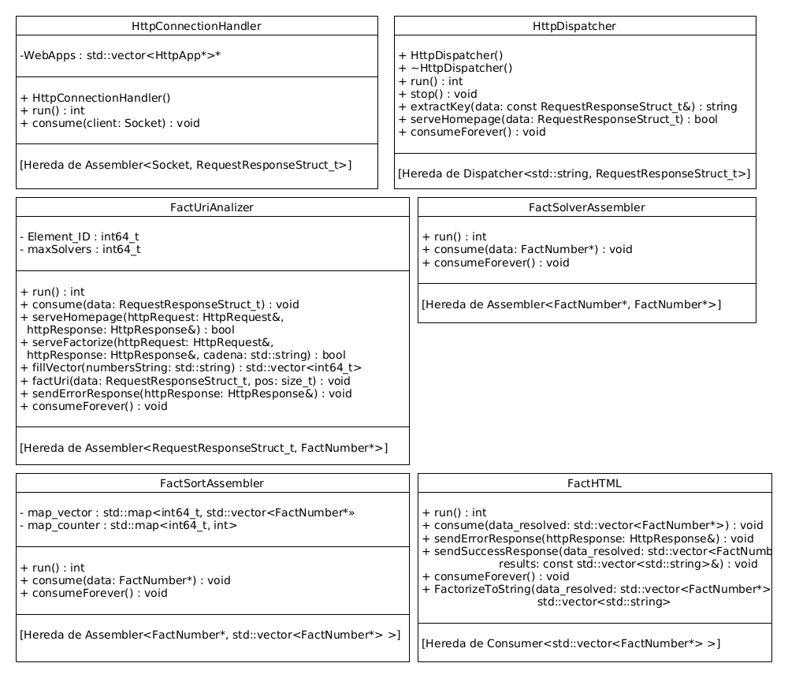

# Diseño con servidor web concurrente y aplicaciones serializadas

El proyecto presenta una solución para gestionar solicitudes HTTP entrantes en un entorno de servidor web. Integrando la concurrencia mediante hilos y una cola de sockets, se logra una arquitectura robusta que maneja múltiples conexiones simultáneas de manera eficiente y escalable.

En el núcleo de esta solución se encuentra la clase HttpConnectionHandler, que actúa como punto de entrada para las solicitudes entrantes. Al heredar de la clase Consumer<Socket>, HttpConnectionHandler está diseñado para consumir sockets de manera concurrente, permitiendo manejar múltiples conexiones simultáneas, crucial para un servidor web.

Cuando se inicia el servidor, se activa un proceso de producción constante de solicitudes HTTP. Este proceso se ejecuta dentro de un bucle infinito en el método run() de HttpConnectionHandler, donde cada conexión entrante se maneja en un hilo separado, permitiendo al servidor procesar múltiples solicitudes de manera simultánea y eficiente.

La cola de sockets desempeña un papel fundamental en la gestión de la concurrencia en el servidor. Cuando se recibe una conexión entrante, el socket correspondiente se coloca en la cola para su posterior procesamiento, garantizando una gestión ordenada y eficiente de las conexiones entrantes.

Una vez que un socket se retira de la cola, se asigna a un hilo disponible para su procesamiento mediante el método consume(Socket client) de HttpConnectionHandler. Cada hilo ejecuta el flujo de procesamiento estándar, enrutando la solicitud a la aplicación web correspondiente y generando una respuesta adecuada.

Dentro de este proyecto, las WebApps son componentes fundamentales que permiten al servidor web ofrecer funcionalidades específicas a los clientes que realizan solicitudes HTTP. Dos WebApps principales se destacan: FactWebApp y GoldWebApp.

FactWebApp está diseñada para calcular factores primos y GoldWebApp se enfoca en calcular sumas de Goldbach. Ambas tienen métodos para manejar solicitudes HTTP, analizarlas y generar respuestas adecuadas según la naturaleza de la solicitud recibida.

La lógica de enrutamiento de solicitudes se realiza en la clase HttpConnectionHandler, que determina a qué aplicación web debe dirigirse la solicitud entrante basándose en la URI de la solicitud. Una vez determinada la aplicación adecuada, se invoca su método handleHttpRequest() para el procesamiento de la solicitud.

En resumen, la combinación de concurrencia mediante hilos y una cola de sockets proporciona una arquitectura robusta y aceptable para manejar las solicitudes HTTP entrantes en un entorno de servidor web, mientras que las WebApps permiten ofrecer funcionalidades específicas a los clientes.


# Diseño con las aplicaciones concurrentes

Los UMLs de las clases agregadas en esta etapa del proyecto son mostradas a continuación. Las otras que se anexaron son las respectivas de la aplicación sumas de Goldbach, cuyos nombres son: GoldUriAnalizer, GoldSolverAsembler, GoldSortAssembler y GoldHTML, pero no se incluyen por su similitud.



Hemos actualizado el diagrama de flujo de datos de la entrega anterior para optimizar la cadena de producción mediante la implementación del patrón productor-consumidor. La figura siguiente ilustra los cambios realizados en el diseño.


En la parte del servidor, primero se crean las instancias de cada uno de los elementos que compondrán la cadena de producción. Luego, se establece la comunicación entre ellos. Los hilos de los elementos que forman la WebApp se comunican exclusivamente a través de colas, por lo que es necesario crearlas o configurarlas adecuadamente. El servidor se encarga de llamar a cada una de estas instancias y ejecutar los métodos correspondientes, como createOwnQueue, setConsumingQueue o setProducingQueue, según se trate de un consumidor, productor o ensamblador. Además, se registra cada aplicación web ante el servidor para que puedan especificar los criterios que determinen cuándo una solicitud les corresponde. Una vez completadas estas inicializaciones, el sistema queda en espera, "escuchando" las solicitudes entrantes o bien la indicación de finalizar el servidor.

Al igual que en el avance anterior, el servidor solo acepta solicitudes y las pone en cola. Los manejadores de conexiones HTTP (httpConnectionHandler) consumen de las conexiones, extrayendo todas las solicitudes HTTP del cliente. En esta modificación, los httpConnectionHandler no atienden estas solicitudes directamente, sino que las ponen en otra cola.

Un nuevo hilo tipo repartidor (dispatcher) consume las solicitudes de la cola dejada por los httpConnectionHandler. Por cada solicitud, determina a cuál aplicación web va dirigida y la pone en la cola correspondiente.

Trazamos una línea punteada para separar la parte del servidor de la parte de las WebApps. En la parte superior del gráfico se muestra lo que maneja el servidor, y en la parte inferior se ubican lo correspondiente a las aplicaciones.

Dada la similitud entre las dos aplicaciones soportadas, describiremos la aplicación de sumas de Goldbach, teniendo en cuenta que la aplicación de factorización prima sigue un razonamiento similar.

Recordemos que se nos pide que la solución sea lo más eficiente posible. Para ello, debemos aprovechar al máximo los núcleos. Por esta razón, los procesos de la clase “GoldAnalizaURI”, fragmentan las listas de entradas en cada uno de sus componentes y las encola para que los los procesos de “GoldSolverAssembler” las consuman. Es decir, las aplicaciones web son hilos (tantos como CPUs haya disponibles en el sistema) que actúan como productores-consumidores. Cada vez que los solvers de “GoldSolverAssembler” extraen una unidad de trabajo de la cola, calcula lo que le corresponde y el resultado es puesto en otra cola de salida, sin ningún orden particular más que el orden en que sale.

El proceso de clase “GoldSortAssembler” consume los resultados encolados por los solvers y revisa si la solicitud está completa; si lo está, la pone en otra cola ya armada y ordenada tal y como la solicitó el usuario.

El "GoldHTML" consume las solicitudes que ya están resueltas (y completas), arma el mensaje de respuesta HTTP y lo envía a su respectivo solicitante haciendo uso del httpResponse que viene en los nodos.

## Pseudocódigos
A continuación, se presentan los pseudocódigos de los distintos métodos que fueron modificados y los agregados a la solución. Estos pseudocódigos conforman la guía de la conversión del proyecto para que funcione de manera concurrente. Brindan una visión de cómo se desarrollaron y optimizaron los diferentes procesos para lograr los objetivos establecidos.

### Clase HttpConnectionHandler

```sh
ALGORITMO run
/* Se mantiene consumiendo sockets */
ENTRADAS: no tiene
Ejecuta consumeForever();
DEVUELVE: si tuvo exito o no
FIN DE run
```

```sh
ALGORITMO consume
ENTRADAS: client
// Bucle infinito para manejar múltiples peticiones en la misma conexión
Mientras verdadero hacer
  // Crear un objeto para analizar la petición HTTP desde el socket
  solicitudHTTP := Nueva HttpRequest(cliente)
  
  // Intentar analizar la petición HTTP
  Si solicitudHTTP.analizar() = falso Entonces
    // Si la petición no es válida, salir del bucle
    salir
  fin si
  
  // Crear un objeto para responder a la petición del cliente
  respuestaHTTP := Nueva HttpResponse(cliente)
  
  // Delegar la respuesta a la petición en una subclase
  manejado := manejarPeticionHttp(solicitudHTTP, respuestaHTTP)
  
  // Verificar si la subclase no manejó la petición o si se utilizó HTTP/1.0
  Si manejado = falso o solicitudHTTP.obtenerVersionHttp() = "HTTP/1.0" entonces
    // Cerrar la conexión del socket y salir del bucle
    cliente.cerrar()
    salir
  fin si
fin Mientras
DEVUELVE: no devuelve nada
FIN DE consume
```

```sh
ALGORITMO handleHttpRequest
/* Imprimir IP y puerto desde el cliente */
ENTRADAS: httpRequest, httpResponse
dirección := solicitudHttp.obtenerDireccionRed()
Log.anexar(Log.INFO, "conexión",
  "conexión establecida con cliente " + dirección.obtenerIP() +
  " puerto " + convertirACadena(dirección.obtenerPuerto()))
// Imprimir petición HTTP
Log.anexar(Log.INFO, "petición",
  solicitudHttp.obtenerMétodo() + ' ' + solicitudHttp.obtenerURI() + ' ' +
  solicitudHttp.obtenerVersionHttp())
// Retornar el resultado de dirigir la petición y respuesta HTTP
retornar route(solicitudHttp, respuestaHttp)
DEVUELVE: si encuentra o no
FIN DE handleHttpRequest
```

```sh
ALGORITMO route
/* Recorrer la cadena de aplicaciones */
ENTRADAS: httpRequest, httpResponse
// Recorrer la cadena de aplicaciones
Para índice desde 0 hasta tamañoDe(aplicaciones) - 1 hacer
  // Si esta aplicación maneja la petición
  app := plicaciones[índice]
  Si app.manejarPeticionHttp(solicitudHttp, respuestaHttp) entonces
    // Si la petición es manejada, retornar verdadero
    retornar verdadero
  fin Si
fin Para
// Petición no reconocida
DEVUELVE: si encuentra o no
FIN DE route
```

```sh
ALGORITMO serveNotFound
/* Set HTTP response metadata (headers) */
/*  */
ENTRADAS: httpRequest, httpResponse
Establecer los metadatos de la respuesta HTTP (cabeceras)

// Construir el cuerpo del mensaje en HTML
título := "No encontrado"
mensajeRespuesta queda en respuestaHttp.cuerpo()
Enviar la respuesta al cliente (agente usuario)
DEVUELVE: exito o fracaso del envío
FIN DE serveNotFound
```

### Clase FactWebApp

```sh
ALGORITMO handleHttpRequest
/* Maneja la solicitudes de la app Factorizacion prima y entrega de los resultados */
ENTRADAS: httpRequest, httpResponse
// Si se solicita la página principal
Si (si el metodo es GET y viene "/fact") 
  llama a serveHomepage(httpRequest, httpResponse)
Fin Si

Si (Si la solicitud comienza con "fact/" es para esta aplicación web) {
  llama a serveFactorization(httpRequest, httpResponse)
fin Si
DEVUELVE: exito o fracaso del envio
FIN DE handleHttpRequest
```

```sh
ALGORITMO serveHomepage
/* Se ocupa de enviar un formulario de solicitud de datos al usuario */
ENTRADAS: httpRequest, httpResponse
Establecer los metadatos de la respuesta HTTP (cabeceras)
// Construir el cuerpo de la respuesta
título := "Factorización Prima"
Armar el cuerpo del formulario de solicitud en HTML 
  y dejarlo en respuestaHttp.cuerpo()
Enviar la respuesta al cliente (agente usuario)
retornar respuestaHttp.enviar()
DEVUELVE: exito o fracaso del envio
FIN DE serveHomepage
```

```sh
ALGORITMO serveFactorizaction
/* Este metodo se ocupa de recibir los datos del formulario previamente  */
 * enviado al usuario, contiene las entradas para factorizacion prima.   */
 * Indaga los factores y devueve los resultados en un HTML al navegador  */
ENTRADAS: httpRequest, httpResponse
Establecer los metadatos de la respuesta HTTP (cabeceras)
Extraer los números del URI y almacenarlos en un vector
La longitud de "number=" es 7
cadenaNumeros := solicitudHttp.obtenerURI().subcadena(pos + 7)
// Vector de números enteros con los números del URI
vectorNumeros := llenarVector(cadenaNumeros)
// Vector de vectores de enteros con los resultados de la factorización
resultadosFactores := obtenerResultados(vectorNumeros)
resultadosComoString := factorizarComoString(resultadosFactores)
enviarRespuestaExitosa(respuestaHttp, vectorNumeros, resultadosComoString)
enviar mensaje de error en html a respuestaHttp
Enviar la respuesta al cliente (agente usuario)
llamar a  respuestaHttp.enviar()
DEVUELVE: exito o fracaso del envio
FIN DE serveFactorizaction
```

```sh
ALGORITMO sendSuccessResponse
/* Envía al navegador la respuesta exitosa */
ENTRADAS: httpResponse, http numbersVector, results
título := "Factorización Prima"
Armar Html de respuesta y dejarlo en HttpResponse.body()
Para i desde 0 hasta tamañoDe(vectorNumeros) - 1 hacer
  número := convertirACadena(vectorNumeros[i])
  resultado := resultados[i]
  Agrega los resultados calculados al HTML a .body()
Fin Para
DEVUELVE: no devuelve nada
FIN DE sendSuccessResponse
```

```sh
ALGORITMO: sendErrorResponse
/* Atiende el caso cuando viene un error en la solicitud */
ENTRADAS: httpResponse, vectorPara, 
Construir el cuerpo en Html para una solicitud inválida y dejarlo en respuestaHttp.body()
título := "Solicitud inválida"
enviar respuestaHttp.body()
DEVUELVE: no devuelve nada
FIN DE sendErrorResponse
```

```sh
ALGORITMO fillVector
/* Llena de numeros el vector */
ENTRADAS: numbersString
vectorNumeros := nuevo vector de enteros
// Suprime los caracteres especiales '%2C' que representan comas
Mientras verdadero hacer
  posiciónComa := encontrar(cadenaNumeros, "%2C")
  Si posiciónComa == noEncontrado entonces
     salir del ciclo
  fin si
  reemplazar(cadenaNumeros, posiciónComa, 3, " ")
fin Mientras
// Separar la cadena en números individuales y agregarlos al vector
Para cada número en dividir(cadenaNumeros, " ") hacer
    númeroEntero := convertirAEntero64Bits(número)
    agregarAlFinal(vectorNumeros, númeroEntero)
fin Para
DEVUELVE: vectorNumeros
FIN DE fillVector
```

```sh
ALGORITMO getResults
/* Obtiene los resultados */
ENTRADAS: numbersString
Factorizacion := nuevo FactSolver
resultados := nuevo vector de vectores de enteros
resultados = factorizarVector(numerosVector)
retornar resultados
DEVUELVE: numbersVector
FIN DE getResults
```

```sh
ALGORITMO FactorizeToString
/* Acomoda los factores para presentar en hileras */
ENTRADAS: generalFactors
factorizaciones := nuevo vector de cadenas
Para cada factores en factoresGenerales hacer
  // Contar los exponentes de los factores
  conteoExponentes := nuevo mapa desordenado de enteros a enteros
  Para cada factor en factores hacer
    conteoExponentes[factor]++
  fin Para
  Construir la cadena de factorización
  factorizacion := cadena vacía
  Para cada par en conteoExponentes hacer
    factorizacion += convertirACadena(par.primerElemento)
    Si par.segundoElemento > 1 entonces
        factorizacion += "^" + convertirACadena(par.segundoElemento)
    fin si
    factorizacion += " * "
  fin Para
  // Eliminar los últimos caracteres " * " si están presentes
  Si no está vacía(factorizacion) entonces
     eliminarUltimosCaracteres(factorizacion, 3) // Eliminar 3 últimos caracteres
  fin Si
  agregar factorizacion al Final de factorizaciones
fin Para
DEVUELVE: factorizaciones
FIN DE FactorizeToString
```

### Clase GoldWebApp

```sh
ALGORITMO handleHttpRequest
/* Maneja la solicitudes de la app goldbach entrantes y generar las respuestas */
ENTRADAS: httpRequest, httpResponse
Si (el metodo es GET y viene "/gold") 
  llama a serveHomepage(httpRequest, httpResponse)  // de la clase goldWebApp
Fin Si

Si (HTTP es GET y la URI viene con /gold) {
  // la solicitud viene con "/gold" entonces es para esta aplicación web
  llama a serveGoldbach(httpRequest, httpResponse)
fin Si
DEVUELVE: exito o fracaso del envio
FIN DE handleHttpRequest
```

```sh
ALGORITMO serveHomepage
/* Se ocupa de enviar un formulario de solicitud de datos al usuario */
ENTRADAS: solicitudHTTP, respuestaHTTP
Establecer metadatos de respuesta HTTP (encabezados)
respuestaHTTP.establecerEncabezado("Servidor", "AttoServer v1.1")
respuestaHTTP.establecerEncabezado("Content-type", "text/html; charset=ascii")

// Construir el cuerpo de la respuesta
cadena titulo = "Sumas de Goldbach "
Arma el HTML de solicitud y lo deja en respuestaHTTP.cuerpo()

// Enviar la respuesta al cliente (agente de usuario)
respuestaHTTP.enviar()
DEVUELVE: exito o fracaso del envio
FIN DE serveHomepage
```

```sh
ALGORITMO serveGoldbach
ENTRADAS: httpSolicitud, httpRespuesta
// Este metodo se ocupa de recibir los datos del formulario previamente enviado
// al usuario, contiene las entradas para sumas de Golbach. 
// Indaga las sumas y devueve los resultados en un HTML al navegador

Realiza inicializaciones de variables

Establecer metadatos de respuesta HTTP (encabezados)
// Uniformar el URI para que el separador sea espacio
cadena nuevoUri = reemplazarExpresiónRegular(numerosCadena, "%..", " ")
// Expresión regular para buscar números enteros
expresiónRegular patron = "-?[0-9]+"
vector<int64_t> vectorNumeros // Vector para almacenar todos los números
Mientras (haya mas datos que coincidan con la expresion regular) hacer
  str = obtenerCadenaCoincidente()
  longitud = longitudCadena(str)
  Validar la entrada dada por el usuario, y si hay error salir 
    del bucle para devolver un mensaje
  entero valor = convertir a numero entero el patron encontrado
  agregarElementoAlFinal(vectorNumeros, valor)
  avanzarIteradorInicio()
fin Mientras

Si (no hayError) entonces
  cadena titulo = "Sumas de Goldbach"
  Armar el HTML de solicitud y madarlo por httpRespuesta.cuerpo()
  instanciaGoldSolver = GoldSolver(vectorNumeros)
  Para cada elemento en vectorNumeros hacer
    // Agregar los resultados particulares
    cadena resultado = obtenerResultadoGoldbach(elemento)
    enviar resultado por httpRespuesta.cuerpo()
  fin Para
fin Si
sino
  hayError = verdadero
fin_si
Si(hayError) entonces
  // Construir el cuerpo de mensaje para una solicitud inválida
  cadena titulo = "Solicitud inválida"
  Arma un HTML indicando que hubo error y lo envia por httpRespuesta.cuerpo()
fin_si
// Enviar la respuesta al cliente 
httpRespuesta.enviar()
DEVUELVE: éxito o fracaso del envio
FIN DE serveGoldbach
```

### Clase HttpDispatcher

```sh
ALGORITMO run
/* Consume sockets y los clasifica de acuerdo a la aplicación en la cola debida.
 * Cuando llega la indicación de finalizar, se ocupa de ello                    */
ENTRADAS: ninguna
Ejecuta consumeForever()
Al salir del ciclo consumeforever, colocar en las colas la condicion de parada 1
DEVUELVE: indicación de Exito
FIN DE run.
```

```sh
ALGORITMO extractKey
/* Analiza la URI del objeto data y extrae una clave indicada ahí */
ENTRADAS: data // un objeto de tipo RequestResponseStruct_t
Obtener la URI de la solicitud HTTP de data
Extraer la subcadena de la URI desde la posición 1 y de longitud 4
Si la clave no se encuentra en el diccionario Entonces
  key = "fact"
Fin Si
DEVUELVE key // Cadena de caracteres
FIN DE extractKey
```

```sh
ALGORITMO consumeForever
/* Consume datos indefinidamente desde la cola hasta encontrar una condición de parada */
ENTRADAS: ninguna
Asegurarse de que la cola no sea nula
Mientras verdadero Hacer
  Obtener el siguiente dato de la cola
  Si viene la condición de parada Entonces
    Salir del bucle
  Sino
    Extraer del la cola el socket
    Colocar en cola correspodiente el socket
  Fin Si
Fin Mientras

FIN DE consumeForever
```

### Clase FactUriAnalizer

```sh
ALGORITMO run
/* Se mantiene consumiendo sockets */
ENTRADAS: no tiene
Ejecuta consumeForever();
DEVUELVE: si tuvo exito o no
FIN DE run
```

```sh
ALGORITMO consume
ENTRADAS: client
// Bucle infinito para manejar múltiples peticiones en la misma conexión
Mientras verdadero hacer
  // Crear un objeto para analizar la petición HTTP desde el socket
  solicitudHTTP := Nueva HttpRequest(cliente)
  
  // Intentar analizar la petición HTTP
  Si solicitudHTTP.analizar() = falso entonces
    // Si la petición no es válida, salir del bucle
    salir
  fin si
  
  // Crear un objeto para responder a la petición del cliente
  respuestaHTTP := Nueva HttpResponse(cliente)
  
  // Delegar la respuesta a la petición en una subclase
  manejado := manejarPeticionHttp(solicitudHTTP, respuestaHTTP)
  
  // Verificar si la subclase no manejó la petición o si se utilizó HTTP/1.0
  Si manejado = falso o solicitudHTTP.obtenerVersionHttp() = "HTTP/1.0" entonces
    // Cerrar la conexión del socket y salir del bucle
    cliente.cerrar()
    salir
  fin si
fin Mientras
DEVUELVE: no devuelve nada
FIN DE consume
```

```sh
ALGORITMO factUri
/* Procesa una solicitud HTTP para factorizar números y genera respuestas basadas en la URI */
ENTRADAS: data, pos
  // data contiene la solicitud y respuesta HTTP.
  // pos es la inicial del parámetro `number=` en la URI.
  Extraer la subcadena de la URI comenzando desde `pos + 7` (donde `7` es la longitud de la cadena "number=") y almacenar esta subcadena en `numbersString`
  Llama a fillVector(numbersString) para convertir `numbersString` en un vector de enteros numbersVector
  Si (numbersVector está vacío) entonces
    Envia una respuesta de error y termina la ejecución del método
  Fin Si
  Incrementar el contador global de Element_ID en 1
  Para cada número en numbersVector hacer
    Crear un nuevo objeto FactNumber con los parámetros (respuesta HTTP, Element_ID, índice del número, el número en sí, y el tamaño de numbersVector)
    Llamar a produce(number) para procesar el número
  Fin Para
DEVUELVE: no devuelve nada
FIN DE factUri
```

```sh
ALGORITMO serveHomepage
/* Se ocupa de enviar un formulario de solicitud de datos al usuario */
ENTRADAS: httpRequest, httpResponse
Establecer los metadatos de la respuesta HTTP (cabeceras)
// Construir el cuerpo de la respuesta
título := "Factorización Prima"
Armar el cuerpo del formulario de solicitud en HTML 
  y dejarlo en respuestaHttp.cuerpo()
Enviar la respuesta al cliente (agente usuario)
retornar respuestaHttp.enviar()
DEVUELVE: exito o fracaso del envio
FIN DE serveHomepage
```

```sh
ALGORITMO: sendErrorResponse
/* Atiende el caso cuando viene un error en la solicitud */
ENTRADAS: httpResponse, vectorPara, 
Construir el cuerpo en Html para una solicitud inválida y dejarlo en respuestaHttp.body()
título := "Solicitud inválida"
enviar respuestaHttp.body()
DEVUELVE: no devuelve nada
FIN DE sendErrorResponse
```

```sh
ALGORITMO fillVector
/* Llena de numeros el vector */
ENTRADAS: numbersString
vectorNumeros := nuevo vector de enteros
// Suprime los caracteres especiales '%2C' que representan comas
Mientras verdadero hacer
  posiciónComa := encontrar(cadenaNumeros, "%2C")
  Si posiciónComa == noEncontrado entonces
     salir del ciclo
  fin si
  reemplazar(cadenaNumeros, posiciónComa, 3, " ")
fin Mientras
// Separar la cadena en números individuales y agregarlos al vector
Para cada número en dividir(cadenaNumeros, " ") hacer
    númeroEntero := convertirAEntero64Bits(número)
    agregarAlFinal(vectorNumeros, númeroEntero)
fin Para
DEVUELVE: vectorNumeros
FIN DE fillVector
```

### Clase FactSolverAssembler

```sh
ALGORITMO run
/* Se mantiene consumiendo sockets */
ENTRADAS: no tiene
Ejecuta consumeForever();
DEVUELVE: si tuvo exito o no
FIN DE run
```

```sh
ALGORITMO consume
/* Consume un objeto FactNumber, lo factoriza y produce una respuesta */
ENTRADA: data (puntero a un objeto FactNumber)
Crear una instancia de FactSolver con nombre solver
Inicializar un vector llamado factors para almacenar los factores
// Encuentra los factores primos
prime = 2
Mientras data.numero > 1 hacer
  Si (data.numero % prime = 0) entonces
    factors.agregar(prime)
    data.numero ← data.numero / prime
  Sino
    prime = prime + 1
  Fin Si
Fin Mientras
Asignar los factores al objeto data
Llamar a produce(data) para encolar el dato
DEVUELVE: no devuelve nada
FIN DE consume
```

### Clase FactSortAssembler

```sh
ALGORITMO run
/* Se mantiene consumiendo sockets */
ENTRADAS: no tiene
Ejecuta consumeForever();
DEVUELVE: si tuvo exito o no
FIN DE run
```

```sh
ALGORITMO: consume
/* Este método consume datos de tipo FactNumber y los organiza en vectores asociados a claves.
 * Si se han recibido todos los datos para una clave, se produce el vector resultante y 
 * se eliminan las entradas correspondientes de los mapas. */
ENTRADAS: FactNumber*  // Puntero a un objeto de tipo FactNumber que contiene los datos a consumir.
          map_counter  // mapa que asocia claves (id) con contadores de datos pendientes.
          map_vector   // mapa que asocia claves (id) con vectores de datos (FactNumber*).
Buscar la clave en el mapa de contadores y dejarla en it_counter
Buscar la clave en el mapa de vectores y dejarla en it
SI it existe en map_vector Entonces
  it.valor[data.index] = data  // Actualizar el vector asociado con los nuevos datos
  it_counter.valor = it_counter.valor - 1
  SI it_counter.valor == 0 /* Se recibieron todos los datos */ Entonces
    producir = it.valor
    eliminar it_counter de map_counter
    eliminar it de map_vector
    llamar a produce(producir)
    Retornar
  Fin Si
Sino
  // Se agrega un nuevo vector si no existe
  nuevoVector = nuevo vector de tamaño data.maxNumbers
  nuevoVector[data.index] = data
  SI data.maxNumbers == 1 Entonces
    llamar a produce(nuevoVector)
    Retornar
  Fin Si
  map_counter[data.id] = data.maxNumbers - 1
  map_vector[data.id] = nuevoVector
Fin Si
DEVUELVE: Nada.
FIN DE consume
```

### Clase FactHTML

```sh
ALGORITMO run
/* Se mantiene consumiendo sockets */
ENTRADAS: no tiene
Ejecuta consumeForever();
DEVUELVE: si tuvo exito o no
FIN DE run
```

```sh
ALGORITMO consume
/* Procesa cada objeto FactNumber en data_resolved para construir cadenas de factorización en HTML. Luego envía la respuesta al navegador */
ENTRADAS: data_resolved  //vector de punteros a objetos FactNumber
data_resolved[0]->httpResponse.setHeader("Server", "AttoServer v1.0")
data_resolved[0]->httpResponse.setHeader("Content-type", "text/html; charset=ascii")
factorizations <- vector de cadenas vacío
Para i Desde 0 Hasta tamaño(data_resolved) - 1 Hacer
  factors <- data_resolved[i]->numbersVector
  exponentCount <- diccionario vacío
  Para cada factor en factors Hacer
    exponentCount[factor]++
  Fin Para
  results <- cadena vacía
  Para cada index En exponentCount Hacer
    results <- results + convertir_a_cadena(index->first)
    Si index->second es mayor que 1 Entonces
      results <- results + "^" + convertir_a_cadena(index->second)
    Fin Si
    results <- results + " * "
  Fin Para
  Si results no etá vacío Entonces
    Eliminar ultimo caracter
  Fin Si
  guardar results en factorizations
Fin Para
sendSuccessResponse(data_resolved, results)
DEVUELVE: nada
FIN DE consume
```

```sh
ALGORITMO sendSuccessResponse
/* Envía al navegador la respuesta exitosa */
ENTRADAS: httpResponse, http numbersVector, results
título := "Factorización Prima"
Armar Html de respuesta y dejarlo en HttpResponse.body()
Para i desde 0 hasta tamañoDe(vectorNumeros) - 1 hacer
  número := convertirACadena(vectorNumeros[i])
  resultado := resultados[i]
  Agrega los resultados calculados al HTML a .body()
Fin Para
DEVUELVE: no devuelve nada
FIN DE sendSuccessResponse
```

### Clase GoldUriAnalizer

```sh
ALGORITMO run
/* Se mantiene consumiendo sockets */
ENTRADAS: no tiene
Ejecuta consumeForever();
DEVUELVE: si tuvo exito o no
FIN DE run
```

```sh
ALGORITMO: sendErrorResponse
/* Atiende el caso cuando viene un error en la solicitud */
ENTRADAS: httpResponse, vectorPara, 
Construir el cuerpo en Html para una solicitud inválida y dejarlo en respuestaHttp.body()
título := "Solicitud inválida"
enviar respuestaHttp.body()
DEVUELVE: no devuelve nada
FIN DE sendErrorResponse
```

```sh
ALGORITMO consume
/* Analiza y procesa solicitudes HTTP para la URI "/gold/gold" con números en los parámetros. */
ENTRADAS: data //estructura RequestResponseStruct_t
Si data.httpRequest.getMethod() == "GET" Y data.httpRequest.getURI() == "/" Entonces
  llamar a sendErrorResponse(data.httpResponse)
Sino SI data.httpRequest.getMethod() == "GET" Y data.httpRequest.getURI() == "/gold" Entonces
  llamar a serveHomepage(data.httpRequest, data.httpResponse)
Sino SI data.httpRequest.getURI().comienzaCon("/gold/gold") Entonces
  SI data.httpRequest.getURI().contiene("number=") Entonces
    numbersVector = []
    pos = encontrarPosicion(data.httpRequest.getURI(), "number=")
    numbersString = subcadena(data.httpRequest.getURI(), pos + 7)
    // Reemplazar caracteres codificados por porcentaje con espacios
    nuevoUri = reemplazarCaracteresPorcentaje(numbersString)
    // Expresión regular para encontrar números enteros
    matches = encontrarCoincidencias(nuevoUri, "-?[0-9]+")
    Para Cada match en matches Hacer
      value = convertirAEntero(match)
      agregar numbersVector, value
    Element_ID = Element_ID + 1
    Para i Desde 0 HASTA tamaño(numbersVector) - 1 Hacer
      Nuevo = crearElementoNumbers(Element_ID, i, numbersVector[i], tamaño(numbersVector) 
        , data.httpResponse)
      llamar a produce(Nuevo) // Encola cada entrada
    }
  Fin Si
Sino
  llamar a sendErrorResponse(data.httpResponse)
Fin Si
Fin DE consume
```

```sh
ALGORITMO serveHomepage
/* Se ocupa de enviar un formulario de solicitud de datos al usuario */
ENTRADAS: httpRequest, httpResponse
Establecer los metadatos de la respuesta HTTP (cabeceras)
// Construir el cuerpo de la respuesta
título := "Goldbach sums"
Armar el cuerpo del formulario de solicitud en HTML 
  y dejarlo en respuestaHttp.body()
Enviar la respuesta al cliente (agente usuario)
retornar respuestaHttp.enviar()
DEVUELVE: exito o fracaso del envio
FIN DE serveHomepage
```

### Clase GoldSolverAssembler

```sh
ALGORITMO run
/* Se mantiene consumiendo sockets */
ENTRADAS: no tiene
Ejecuta consumeForever();
DEVUELVE: si tuvo exito o no
FIN DE run
```

```sh
ALGORITMO consume
/* Consume un objeto Numbers_t, lo procesa utilizando GoldSolver y encola el resultado */
ENTRADAS: number  // el objeto que contiene el número a procesar
crear objeto solver de tipo GoldSolver
llamar a solver.resolveGoldbach(number)
llamar a produce(number)
DEVUELVE: Nada
FIN DE consume
```

### Clase GoldSortAssembler

```sh
ALGORITMO run
/* Se mantiene consumiendo sockets */
ENTRADAS: no tiene
Ejecuta consumeForever();
DEVUELVE: si tuvo exito o no
FIN DE run
```

```sh
ALGORITMO consume
/* Consume un objeto Numbers_t, actualiza los mapas de contadores y vectores, y produce el vector cuando está completo */
ENTRADAS: data  // data es el objeto que contiene el número a procesar
it_counter = buscarEnMapa(map_counter, data.id)
it = buscarEnMapa(map_vector, data.id)
Si it existe EN map_vector ENTONCES
  actualizarElemento(it, data.index, data)
  reducirContador(it_counter)
  Si contadorEsCero(it_counter) Entonces
    producirVector = obtenerVector(it)
    eliminarEntrada(map_counter, it_counter)
    eliminarEntrada(map_vector, it)
    llamar a produce(producirVector)
    Retornar
  Fin Si
Sino
  nuevoVector = crearVector(data.maxNumbers)
  actualizarElemento(nuevoVector, data.index, data)

  SI data.maxNumbers == 1 Entonces
    llamar a produce(nuevoVector)
    Retornar
  Fin Si
  actualizarMapa(map_counter, data.id, data.maxNumbers - 1)
  actualizarMapa(map_vector, data.id, nuevoVector)
Fin Si
DEVUELVE: Nada
FIN DE consume
```

## Clase GoldHTML

```sh
ALGORITMO run
/* Se mantiene consumiendo sockets */
ENTRADAS: no tiene
Ejecuta consumeForever();
DEVUELVE: si tuvo exito o no
FIN DE run
```

```sh
ALGORITMO consume
/* Genera una respuesta HTML a partir de un vector de objetos Numbers_t */
ENTRADAS: data // es el vector que contiene los objetos Numbers_t a procesar
response = data[0].httpResponse
title = "Goldbach Sums"
Preparar HTML de la respuesta
stringSums = create_strings(data)
Para i Desde 0 Hasta data[0].maxNumbers - 1 Hacer
  Agregar numbers[i]->number a lista de sumas
Fin Para
Establecer metadatos de la respuesta HTTP (cabeceras)
sendSuccessResponse(httpResponse, Numbers)
FIN DE consume
```

```sh
ALGORITMO create_strings
/* Crea un vector de cadenas a partir de un vector de objetos Numbers_t */
ENTRADAS: data // Es el vector que contiene los objetos Numbers_t a procesar
Agregar el numero de entrada en hilera
Para cada entrada del vector numbers Hacer
  Si debe mostrar las sumas Entonces
    Construye la cadena de sumas de Goldbach en hilera
Fin Para
Agrega hilera a stringSums
DEVUELVE: stringSums // vector de cadenas
FIN DE create_strings
```

```sh
ALGORITMO sendSuccessResponse
/* Envía al navegador la respuesta exitosa */
ENTRADAS: httpResponse, http numbersVector, results
título := "Factorización Prima"
Armar Html de respuesta y dejarlo en HttpResponse.body()
Para i desde 0 hasta tamañoDe(vectorNumeros) - 1 hacer
  número := convertirACadena(vectorNumeros[i])
  resultado := resultados[i]
  Agrega los resultados calculados al HTML a .body()
Fin Para
DEVUELVE: no devuelve nada
FIN DE sendSuccessResponse
```
