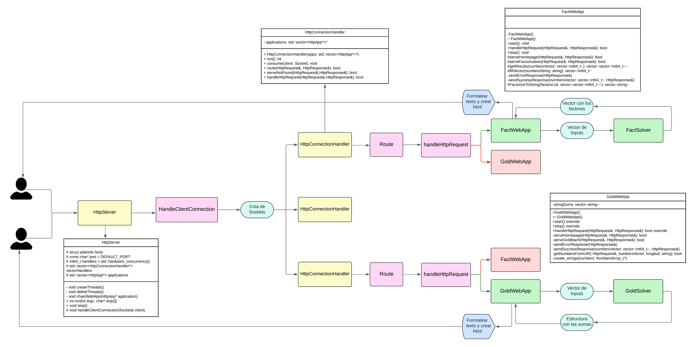

El proyecto presenta una solución sofisticada para gestionar solicitudes HTTP entrantes en un entorno de servidor web. Integrando la concurrencia mediante hilos y una cola de sockets, se logra una arquitectura robusta que maneja múltiples conexiones simultáneas de manera eficiente y escalable.

En el núcleo de esta solución se encuentra la clase HttpConnectionHandler, que actúa como punto de entrada para las solicitudes entrantes. Al heredar de la clase Consumer<Socket>, HttpConnectionHandler está diseñado para consumir sockets de manera concurrente, permitiendo manejar múltiples conexiones simultáneas, crucial para un servidor web.

Cuando se inicia el servidor, se activa un proceso de producción constante de solicitudes HTTP. Este proceso se ejecuta dentro de un bucle infinito en el método run() de HttpConnectionHandler, donde cada conexión entrante se maneja en un hilo separado, permitiendo al servidor procesar múltiples solicitudes de manera simultánea y eficiente.

La cola de sockets desempeña un papel fundamental en la gestión de la concurrencia en el servidor. Cuando se recibe una conexión entrante, el socket correspondiente se coloca en la cola para su posterior procesamiento, garantizando una gestión ordenada y eficiente de las conexiones entrantes.

Una vez que un socket se retira de la cola, se asigna a un hilo disponible para su procesamiento mediante el método consume(Socket client) de HttpConnectionHandler. Cada hilo ejecuta el flujo de procesamiento estándar, enrutando la solicitud a la aplicación web correspondiente y generando una respuesta adecuada.

Dentro de este proyecto, las WebApps son componentes fundamentales que permiten al servidor web ofrecer funcionalidades específicas a los clientes que realizan solicitudes HTTP. Dos WebApps principales se destacan: FactWebApp y GoldWebApp.

FactWebApp está diseñada para calcular factores primos y GoldWebApp se enfoca en calcular sumas de Goldbach. Ambas tienen métodos para manejar solicitudes HTTP, analizarlas y generar respuestas adecuadas según la naturaleza de la solicitud recibida.

La lógica de enrutamiento de solicitudes se realiza en la clase HttpConnectionHandler, que determina a qué aplicación web debe dirigirse la solicitud entrante basándose en la URI de la solicitud. Una vez determinada la aplicación adecuada, se invoca su método handleHttpRequest() para el procesamiento de la solicitud.

En resumen, la combinación de concurrencia mediante hilos y una cola de sockets proporciona una arquitectura robusta y escalable para manejar eficientemente las solicitudes HTTP entrantes en un entorno de servidor web, mientras que las WebApps permiten ofrecer funcionalidades específicas a los clientes.

