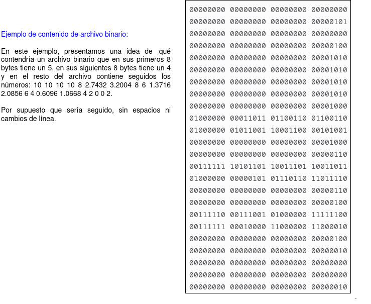

# Análisis del proyecto

## Introducción

El Proyecto 2 de nuestro curso se enfoca en la implementación de técnicas avanzadas de paralelismo utilizando tecnologías como OpenMP y MPI para la distribución de datos. Estas técnicas permiten, de manera breve, dividir tareas complejas en subtareas más pequeñas que pueden ejecutarse simultáneamente, mejorando así la eficiencia y reduciendo los tiempos de procesamiento.

A diferencia del Proyecto 1, donde trabajamos con un código heredado, en este nuevo desafío partimos desde cero, lo que nos brinda la oportunidad de aplicar el conocimiento adquirido durante el curso para diseñar y desarrollar una base de código propia.

En resumen, el Proyecto 2 no solo nos desafía a aplicar técnicas avanzadas de paralelismo y concurrencia, sino que también nos brinda la oportunidad de consolidar nuestras habilidades de desarrollo de software, trabajo en equipo y gestión de proyectos. Con un enfoque riguroso y colaborativo, estamos preparados para crear una solución robusta y eficiente que cumpla con los altos estándares esperados en la industria tecnológica actual.

## Descripción del Problema

Se necesita una sencilla simulación por computadora que ayude a encontrar el momento de equilibro térmico de una lámina rectangular a la que se le inyecta calor constante por su borde. La lámina corresponde a un rectángulo de dos dimensiones de un mismo material. Para efectos de la simulación, el rectángulo es dividido en R filas y C columnas. Esto genera una matriz cuyas celdas son todas cuadradas, de ancho y alto h.

Cada celda de la matriz almacena una temperatura, la cual puede cambiar en el tiempo. Se usa la notación T<sub>k</sub>(i,j) para indicar la temperatura de la celda ubicada en la fila i, columna j, en el instante o estado k. Después de transcurrido un tiempo Δt, la simulación pasará del instante k al instante k+1, y la temperatura en la lámina habrá variado o cambiado de estado. Como es sabido, la energía se transfiere de un área más caliente hacia una más fría. La nueva temperatura en la celda (i,j) será T<sub>k+1</sub>(i,j), y puede estimarse a partir de su temperatura en el instante o estado anterior y la temperatura de sus celdas vecinas por la relación:

<p style="text-align: center;font-size: 24px;">T<sub>k+1</sub>(i,j) = T<sub>k</sub>(i,j) + (Δt * α / h<sup>2</sup>) * (T<sub>k</sub>(i−1,j) + T<sub>k</sub>(i,j+1) + T<sub>k</sub>(i+1,j) + T<sub>k</sub>(i,j−1) − 4T<sub>k</sub>(i,j))</p>

De acuerdo a la relación anterior, la temperatura de una celda (i,j) en el instante o estado k+1 indicada por T<sub>k+1</sub>(i,j), es el resultado de la temperatura que la celda tenía en el instante o estado anterior T<sub>k</sub>(i,j) más la pérdida o ganancia de energía que la celda haya sufrido con sus inmediaciones durante ese período Δt. Para efecto de la simulación, las inmediaciones son las cuatro celdas vecinas en forma de cruz, y no las que están en sus diagonales. Esta transferencia de energía o calor está regida por:

1. La energía que la celda (i,j) recibe de sus inmediaciones, y se calcula como la suma de las temperaturas de las cuatro vecinas T<sub>k</sub>(i−1,j) + T<sub>k</sub>(i,j+1) + T<sub>k</sub>(i+1,j) + T<sub>k</sub>(i,j−1).

2. La energía que la celda pierde y se distribuye a sus cuatro celdas vecinas, calculada como −4T<sub>k</sub>(i,j).

3. La transferencia no es instantánea, sino que depende del área que recorre. Entre mayor es el área de la celda, más tiempo requerirá la energía para desplazarse y equilibrarse con sus vecinas. Por eso la ganancia y pérdida de energía calculada en los dos puntos anteriores, se divide entre el área de la celda h<sup>2</sup>.

4. La cantidad de energía transferida es proporcional al tiempo. Es decir, entre más tiempo Δt se permita entre el estado k y el estado k+1, más energía podrá intercambiar la celda (i,j) con sus vecinas. Por esto, el intercambio de energía calculado en los puntos anteriores se multiplica por la duración del estado Δt.

5. La cantidad de energía intercambiada en el periodo de tiempo depende de la calidad conductora de la lámina. Materiales como la madera son lentos para transmitir energía, mientras que los metales son eficientes para este fin. Para reflejar esta realidad, el intercambio de energía calculado en los puntos anteriores se multiplica por la difusividad térmica, que corresponde a una constante α que indica a qué tasa el material logra transmitir energía desde un punto caliente hacia otro punto frío a través de él. Sus unidades son de área entre tiempo, como m<sup>2</sup>/s ó mm<sup>2</sup>/s. Por ejemplo, la madera tiene una difusividad cercana a 0.08 mm<sup>2</sup>/s, mientras que el oro tiene una difusividas de 127 mm<sup>2</sup>/s; es decir, el oro transfiere calor más de 1500 veces más rápido que la madera. El m<sup>2</sup> son metros cuadrados, mm<sup>2</sup> son milímetros cuadrados y la s representa segundos.

## Solución Propuesta

La solución se implementa en lenguaje C++ y recibe los datos de entrada desde archivos de texto y binarios. Cada hilo de ejecución transfiere los datos a arreglos bidimensionales, donde se procesan hasta alcanzar el equilibrio térmico. Finalmente, los resultados se devuelven al hilo principal, que genera un reporte en archivos de texto y binarios también. Para más detalles sobre la implementación del paralelismo y la distribución, consulte el documento de diseño disponible [aquí](./design/readme.md).


## Manual del usuario

### I. Cómo compilar el programa

Para compilar el programa, siga los pasos indicados a continuación desde la terminal de Linux, asegurándose de estar ubicado en la carpeta raíz del proyecto:

  - 1º. Ejecute el comando `make clean` . Esto eliminará las carpetas bin/, build/ y doc/, limpiando el entorno de compilación previo.</li><br>
  - 2º. A continuación, ejecute el comando ` make` . Este comando compila y vincula los componentes localizados en la subcarpeta src/. Una vez finalizado, el ejecutable se almacenará en la subcarpeta bin/ y llevará el mismo nombre que la carpeta raíz del proyecto.  


Las instrucciones necesarias para ejecutar estos comandos están definidas en el archivo Makefile, el cual se encuentra en la carpeta raíz del proyecto.

### II. Qué es y para qué sirve un Makefile

Este archivo es fundamental para la automatización del proceso de compilación y se estructura de la siguiente manera:
Componentes clave de un Makefile:  
  • Reglas: Cada regla específica cómo construir un objetivo, ya sea un archivo ejecutable o un objeto, a partir de uno o más archivos fuente. También pueden incluir acciones adicionales como eliminar archivos temporales o instalar el programa.  
  • Dependencias: Identifican los archivos que deben existir y estar actualizados para que la regla correspondiente pueda ejecutarse. Estas dependencias son esenciales para determinar qué componentes del proyecto necesitan ser recompilados tras cambios en los archivos.  
  • Comandos: Corresponden a las instrucciones de shell que se ejecutan para construir los objetivos. Estos pueden incluir la compilación de código fuente, la vinculación de objetos, y otras tareas relacionadas.  
  • Variables: Permiten definir y ajustar parámetros como los compiladores y las banderas de compilación, facilitando la configuración y adaptación del proceso de compilación.
Funciones de un Makefile:  
  • Automatización: Optimiza el proceso de compilación asegurando que solo los componentes modificados sean recompilados, lo cual es crucial en proyectos grandes.  
  • Eficiencia: Minimiza el tiempo de desarrollo al limitar la compilación a los elementos que realmente necesitan actualización, evitando procesos innecesarios.  
  • Organización: Mejora la gestión del proyecto al proporcionar un conjunto claro y estructurado de instrucciones de compilación, lo que facilita la colaboración en equipos de desarrollo.  
Este enfoque asegura una metodología eficiente y organizada para la compilación de proyectos, adaptándose tanto a necesidades individuales como colectivas en el entorno de desarrollo.   

### III. Ejecutar el programa

Para ejecutar el programa desde línea de comandos de linux, simplemente ingrese el nombre del ejecutable (sin extensión), añadiendo dos valores como parámetros:

- El primero será el nombre de un archivo de trabajo. Es obligatorio. Si no se especifica, el programa no correrá.

- El segundo será la cantidad de hilos de ejecución. Es opcional. Si no se proporciona, el sistema asumirá el número de hilos equivalente al número de procesadores disponibles en la máquina.

Si ejecuta el programa desde un directorio distinto, deberá proporcionar la ruta completa del ejecutable. Por ejemplo, si el ejecutable se llama 'proyecto2' y está en la carpeta 'bin/', para iniciarlo especificando el archivo 'job001.txt' ubicado en 'jobs/job001' y utilizando un número determinado de hilos, digamos 4, desde la carpeta raíz debería escribir:

```sh
bin/proyecto2 jobs/job001/job001.txt 4
```
Entonces, para aclarar gráficamente tenemos:

<p align="center"></p>

Si no aparece ningún mensaje de error, el proceso se estará ejecutando y solo quedará esperar. Después de un tiempo, se mostrarán ceros en la pantalla y el control volverá al indicador. Los resultados se guardarán en la misma carpeta desde la cual se ejecutó el programa.

En el archivo de reporte se proporcionan los resultados de cada simulación. Este archivo tiene un nombre como 'job###.tsv', donde ### corresponde al mismo número del archivo de trabajo. Si el archivo existe, será sobrescrito.

Las primeras cinco columnas de este archivo contendrán los mismos datos del archivo de trabajo, pero separados por tabuladores. Se agregarán dos columnas adicionales:

1. La cantidad de estados k que transcurrieron para alcanzar el punto de equilibrio.
2. El tiempo transcurrido k*Δt hasta alcanzar el punto de equilibrio, dado en el formato AAAA/MM/DD hh:mm:ss, donde para simplificar, los meses se consideran de 30 días.

<p align="center"></p>


Además, se generará un archivo binario para cada línea de archivo de reporte con el estado de la lámina una vez que haya alcanzado el punto de equilibrio. Estos archivos tendrán el nombre 'plate###-k.bin', donde k corresponde al número de estado que alcanzó el equilibrio y ### es el mismo número del archivo de trabajo.

<p align="center"></p>

## Créditos
**Proyecto:**   Simulación de transferencia de calor.
S
### Autores:
- Juan Diego Soto Castro. Correo: juan.sotocastro@ucr.ac.cr  
- William Morales Fuentes. Correo: william.moralesfuentes@ucr.ac.cr  
- Migueledo Núñez Moreno. Correo: migueledo.nunez@ucr.ac.cr   
### Referencias y fuentes de información
Enunciado del proyecto: https://jeisson.ecci.ucr.ac.cr/concurrente/2022b/proyectos/heat/
