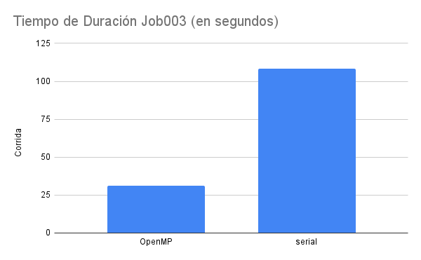
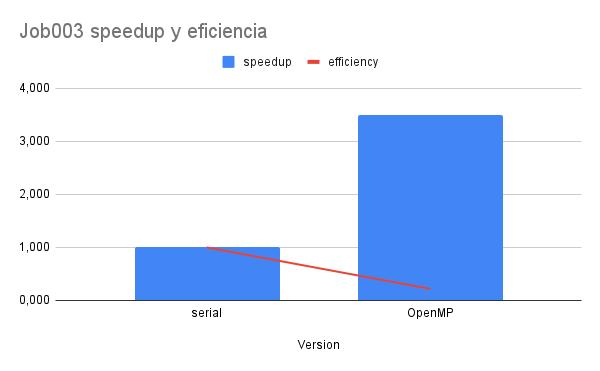
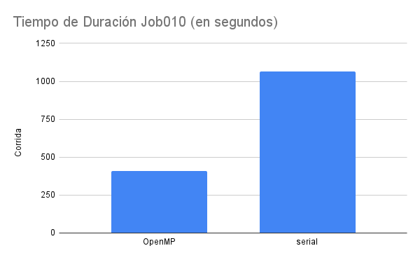
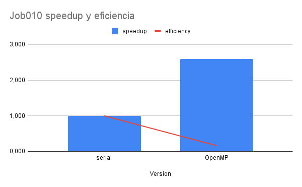

# Análisis Serial vs OpenMP

## 1. Job003

En esta primera prueba, la versión serial obtuvo una duración de 108,5 segundos frente a 31,09 segundos de la versión concurrente, lo que significa que se obtuvo un speedup de 3,490 y una eficiencia de 0,218.

La versión OpenMP, si bien no logra una eficiencia óptima, el aumento de velocidad es aproximadamente 3,5 veces mayor al de su versión serial. Esto demuestra que la utilización de concurrencia en programas de este estilo es crucial, ya que la diferencia de tiempo es muy significativa.

Es importante notar que mientras el speedup es considerable, la eficiencia es relativamente baja. Esto sugiere que aunque hay una mejora sustancial en el tiempo de ejecución, no se está aprovechando completamente el potencial de todos los núcleos disponibles.

## 2. Job010

En el caso de Job010, la duración de la versión serial fue de 1066,39 segundos, mientras que la versión de OpenMP completó la tarea en 410,07 segundos. Esto resulta en un speedup de 2,601 y una eficiencia de 0,163.

Como se puede observar, a medida que aumenta la complejidad del trabajo, el speedup tiende a disminuir. Sin embargo, la versión paralela sigue siendo más de 2,5 veces más rápida que su contraparte serial, lo cual es una mejora significativa en términos de rendimiento.

La eficiencia de 0,163 indica que se está utilizando aproximadamente el 16,3% del potencial teórico de paralelización. Esto puede deberse a varios factores:

1. Overhead de comunicación entre hilos.
2. Desbalance de carga entre los núcleos de procesamiento.

A pesar de la baja eficiencia, la ganancia en tiempo de ejecución sigue siendo considerable, lo que justifica el uso de OpenMP para este tipo de tareas.

## Conclusiones

1. La paralelización con OpenMP ofrece mejoras significativas en el tiempo de ejecución tanto para tareas pequeñas (Job003) como para tareas más grandes (Job010).

2. El speedup es más pronunciado en tareas más pequeñas, pero incluso en tareas más complejas, la ganancia de rendimiento es sustancial.

3. La eficiencia tiende a disminuir a medida que aumenta la complejidad de la tarea, lo que sugiere que hay margen para optimizar aún más el código paralelo.

4. Aunque la eficiencia no es óptima, los beneficios en tiempo de ejecución justifican el uso de OpenMP, especialmente en escenarios donde el tiempo es un factor crítico.

En resumen, el uso de OpenMP demuestra ser una estrategia efectiva para mejorar el rendimiento de las aplicaciones analizadas, ofreciendo reducciones significativas en el tiempo de ejecución a pesar de las oportunidades de mejora en términos de eficiencia.