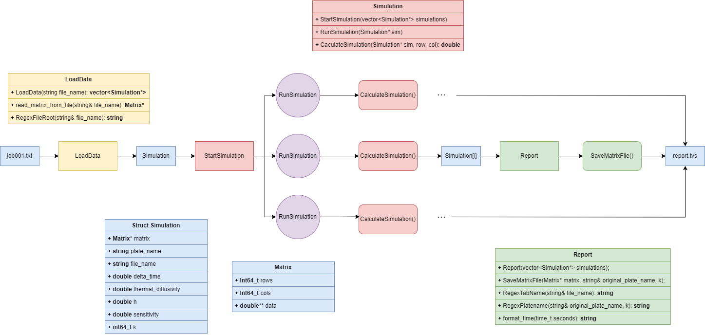

# Diseño

Para lograr la simulación térmica de difusión del calor en una lámina se requerirá:

1. Preparación y lectura del Archivo de Trabajo:
  El algoritmo comienza tomando como entrada el nombre del archivo de trabajo.
  Se realiza la lectura de los parámetros del archivo, asegurándose de que el archivo contenga todas las filas de datos completas y en el formato correcto.
  Se verifica que el archivo de la lámina (con datos binarios) exista y esté disponible.

2. Establecer los parámetros necesarios de Simulación:
  Dt: Duración de cada etapa de simulación en segundos.
  A: Difusividad térmica de la lámina en unidades de área por tiempo.
  h: Dimensiones de la celda (largo y ancho serán iguales).
  E: Sensibilidad del punto de equilibrio, utilizado como criterio de terminación de la simulación.

3. Ejecución de la Simulación Térmica:
  Para cada paso de tiempo k:
    Se crea una copia de la matriz de temperaturas T<sub>k</sub> para almacenar las nuevas temperaturas T<sub>k+1</sub>.
    Se inicializa maxCambioTemp para registrar el máximo cambio de temperatura observado en cada iteración.
    Para cada entrada (i,j) en la matriz de temperaturas:
      Se calcula la nueva temperatura T<sub>k+1</sub>(i,j) utilizando una fórmula basada en la difusión térmica.
      Se calcula la diferencia entre la nueva y la antigua temperatura, tomando su valor absoluto.
      Si esta diferencia es la mayor observada hasta el momento, se actualiza maxCambioTemp.
    Si maxCambioTemp es menor que la sensibilidad E, la simulación termina para ese paso de tiempo, indicando que se ha alcanzado un estado de equilibrio térmico.

4. Almacenamiento y Reporte:
  La matriz de temperaturas resultante se guarda en un archivo de salida binario.
  Se guarda una línea de reporte correspondiente al paso de la simulación.
  Se actualiza la línea correspondiente en el archivo de trabajo.

5. Cierre del Archivo:
  Al finalizar la simulación para todas las líneas del archivo de trabajo, se cierran todos los archivos utilizados.

Este es, a grandes rasgos, el procedimiento del cual partir. Los puntos 2 y 3 constituyen la sección que se puede paralelizar para reducir el tiempo de finalización del proceso. Para conseguir la concurrencia de esta sección, debemos utilizar estructuras que se gestionen en memoria, permitiendo compartir datos entre los diferentes hilos de ejecución que colaboran en el sistema. Esto se explica con más detalle en los pseudocódigos.



El diagrama UML presentado anteriomente ilustra las estructuras y el flujo de procesos del proyecto. En él se detallan las clases, sus atributos y métodos, así como las relaciones entre ellas, proporcionando una visión integral del diseño del sistema. A continuación su explicación.

#### 1. Job001.txt
El programa inicia recibiendo un archivo 'job001.txt', que contiene los "plates.bin" y los datos con los que se trabajarán estas placas.

#### 2. LoadData
LoadData genera un vector de Simulaciones. Cada estructura "Simulación" contiene los datos necesarios para trabajar con ellas:
- Matrix
- Nombre de la placa
- Nombre del archivo
- Tiempo Delta
- Difusividad Térmica
- Tamaño de la placa
- Sensitividad
- Iteraciones K

Además, LoadData se encarga de leer los datos binarios de la Matrix que viene en la estructura de datos "Simulación".

#### 3. StartSimulation
StartSimulation llama al método RunSimulation de manera concurrente, creando varios hilos de ejecución para cada placa. Cada hilo se encargará de trabajar en su placa correspondiente[i].

RunSimulation crea una copia temporal de la matrix. En un ciclo Do-While, llama a la función "CalculateSimulation" con la estructura de datos simulación y los valores i, j que le corresponden.

#### 4. CalculateSimulation
Mediante lógica, utiliza la fórmula que calcula el cambio de temperatura de una placa y la retorna.

#### 5. Report
Recibe un vector de estructuras de datos "Simulación" ya resueltas. Imprime los datos en un archivo TSV con formatos legibles para el humano y llama a SaveMatrixFile.

#### 6. SaveMatrixFile
Guarda el archivo de la placa, pero añade a su nombre "-" + "K iteración". Luego, guarda este archivo binario en la raíz del proyecto.

## Pseudocódigos

A continuación, se presentan los pseudocódigos de la solución. Estos proporcionan una visión detallada de las operaciones y los flujos lógicos que componen nuestro sistema.

```sh
ALGORITMO main
ENTRADAS: argc, argv
  Validar que venga al menos un argumento, sino desplegar mensaje y salir
  job_file = argv[1] // Primer argumento
  
  num_threads = ObtenerNumeroDeHilos() // Asumir # de CPUs del sistema
  // Si se proporciona un argumento adicional, utilizarlo como número de hilos
  SI argc >= 3 ENTONCES
    num_threads = ConvertirAEntero(argv[2]) // # de hilos dado por el usuario
  FIN SI
  Taer los datos desde el archivo especificado
  simulations = CargarDatos(job_file)
  IniciarSimulacion(simulations, num_threads)
  GenerarReporte(simulations)
  PARA CADA simulacion EN simulations HACER
    SI simulacion NO ES NULO Y simulacion->matrix NO ES NULO ENTONCES
      ELIMINAR simulacion->matrix
    FIN SI
    ELIMINAR simulacion
  FIN PARA
  DEVUELVE: exito
FIN DE main.
```

```sh
ALGORITMO Report
ENTRADAS: simulations
  Crea un nuevo nombre de archivo utilizando una función RegexTabName.
  Abre un archivo para escribir los reportes.
  PARA CADA sim EN simulations HACER
    Guarda la matriz en un archivo utilizando una función save_matrix_to_file.
    Formatea el tiempo de la simulación.
    Guardar los datos en archivo en formato TSV
  FIN PARA
  Cerrar archivo
FIN DE Report.
```

```sh
ALGORITMO save_matrix_to_file
ENTRADAS: matrix, original_plate_name, k
  Genera el nombre del archivo utilizando una función RegexPlatename.
  Abre el archivo para escritura en modo binario.
  Escribir la cantidad de filas en 8 bytes
  Escribir la cantidad de columnas en 8 bytes
  Escribir los datos de la matriz 
  // Escribir las filas de la matriz una tras otra
  PARA i = 0 HASTA matrix.rows - 1 HACER
    Escribir la fila i de la matriz
  FIN PARA
  Cerrar archivo
FIN DE save_matrix_to_file.
DEVUELVE: no devuelve nada
```

```sh
ALGORITMO RegexTabName
ENTRADAS: file_name
  name = ""
  patron_nombre_archivo = "job\\d{3}\\." // Define la expresión regular
  Buscar coincidencias en file_name utilizando la expresión regular.
  SI coincidencia_nombre NO ESTÁ VACÍO ENTONCES
    name = coincidencia_nombre[0]
  FIN SI
  name = name + "tsv" // // Agregar extension "tsv"
  DEVUELVE name
FIN DE RegexTabName.
```

```sh
ALGORITMO RegexPlatename
ENTRADAS: original_plate_name, k
  patrón = "plate\\d{3}\\.bin"
  Buscar coincidencias en original_plate_name utilizando la expresión regular.
  file_name = ""
  SI coincidencia NO ESTÁ VACÍO ENTONCES
    base_name = coincidencia[1]
    file_name = base_name + "-" + ConvertirAString(k) + ".bin"
  SI NO
    file_name = original_plate_name // Usa el nombre original
  FIN SI
  DEVUELVE file_name
FIN DE RegexPlatename.
```

```sh
ALGORITMO format_time
ENTRADAS: seconds
  Crear un arreglo de caracteres para almacenar el texto formateado.
  Obtener la estructura de tiempo GMT a partir de seconds.
  Formatear la estructura de tiempo en el arreglo de caracteres.
  Convertir el texto formateado a una cadena.
  DEVUELVE cadena resultante
FIN DE format_time
```

```sh
ALGORITMO StartSimulation
ENTRADAS: simulations, num_threads
  // Inicia la simulación para cada objeto Simulation en el vector.
  PARALELIZAR BUCLE CON num_threads HILOS
  PARA i = 0 HASTA simulations.size() - 1 HACER
    IMPRIMIR ObtenerNumeroDeHilo()
    EjecutarSimulacion(simulations[i])
  FIN PARA
  FIN PARALELIZAR
FIN DE StartSimulation.
```

```sh
ALGORITMO RunSimulation
ENTRADAS: sim
  sensibilidad = sim.sensitivity
  C = 0.0
  sim.k = 0
  temp = sim.matrix.data // Crea una copia temporal de la matriz de datos.
  HACER
    C = 0.0  // Reiniciar la diferencia máxima para la iteración actual
    PARA i = 1 HASTA sim.matrix.rows - 2 HACER
      PARA j = 1 HASTA sim.matrix.cols - 2 HACER
        temp[i][j] = CalcularSimulacion(sim, i, j)  // Calcular el nuevo valor
        diferencia = ABS(sim.matrix.data[i][j] - temp[i][j])
        SI diferencia > C ENTONCES
          C = diferencia  // Actualizar la diferencia máxima
        FIN SI
      FIN PARA
    FIN PARA
    sim.matrix.data = temp // Copiar los nuevos valores a la matriz original
    sim.k++  // Incrementar el contador de iteraciones
  MIENTRAS C > sensibilidad
  Liberar la memoria de la matriz temporal.
FIN DE RunSimulation.
```

```sh
ALGORITMO CaculateSimulation
ENTRADAS: sim, i, j
  Obtiene los valores necesarios de sim: Dt, A y h para calcular nueva temperatura
  T = sim->matrix->data
  Calcular la nueva temperatura mediante:
  nuevo_valor = T(i,j) + (Dt * A / (h * h)) * (T(i-1,j) + T(i,j+1) + T(i+1,j) + T(i,j-1) - 4 * T(i,j) )
  DEVUELVE: nuevo_valor
FIN DE CaculateSimulation.
```

```sh
ALGORITMO LoadData
ENTRADA: file_name
  Abrir el archivo para lectura.
  Crear vector Simulations // Que almacenará punteros a objetos Simulation
  MIENTRAS haya LÍNEAS EN archivo HACER
    Crear sim // Un nuevo objeto Simulation dinámicamente.
    Extraer los valores de la línea de texto y pasar los datos a los campos de sim
    Establecer nombArchivo // Nombre de archivo donde se almacena la lamina
    Obtener la matriz de datos almacenada en archivo nombArchivo
    Agregar el objeto Simulation al vector Simulations
  FIN MIENTRAS
  Cerrar archivo
  DEVOLVER simulations

FIN DE LoadData.
```

```sh
ALGORITMO read_matrix_from_file
ENTRADA: plate_name
  Abrir el archivo para lectura plate_name.
  Leer la cantidad de filas de los primeros 8 bytes.
  Leer la cantidad de columnas de los siguientes 8 bytes.
  Crear la matriz bidimensional matrix con esas dimensiones.
  PARA i = 0 HASTA filas - 1 HACER
    LEER de plate_name (columnas * tamaño_de(double)) bytes y dejarlo en fila matrix(i)
  FIN PARA
  Cerrar plate_name
  RETORNAR matrix
FIN DE read_matrix_from_file.
```

```sh
ALGORITMO RegexFileRoot
ENTRADA: file_name
  file_root = ""
  patrón = "(.+?)job\\d+\\.txt"
  Buscar coincidencias en file_name utilizando la patron
  SI coincidencia NO ESTÁ VACÍO ENTONCES
    file_root = coincidencia[1]
  FIN SI
  DEVUELVE file_root
FIN DE RegexFileRoot.
```
