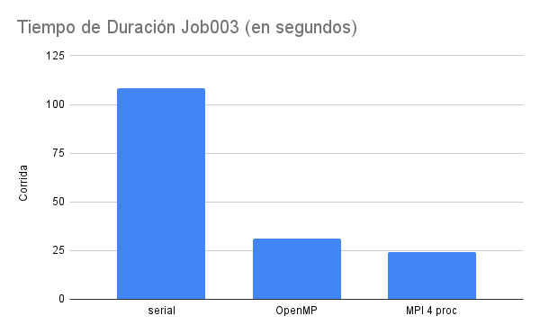

# Análisis Serial vs OpenMP vs MPI

## 1. Job003

El análisis de Job003 muestra resultados prometedores para las implementaciones paralelas. La versión serial completó la tarea en 108.5 segundos, mientras que la versión OpenMP lo hizo en 31.09 segundos y la versión MPI en 24.004 segundos. Esto se traduce en un speedup de 4.520 para MPI comparado con la versión serial, y 1.295 comparado con OpenMP. La eficiencia de la implementación MPI alcanzó un 28.3%.

En esta prueba de menor escala, la versión MPI demostró una eficiencia superior a las pruebas anteriores de OpenMP, logrando una mejora significativa. Con un aumento de velocidad de aproximadamente 4.5 veces respecto a la versión serial, MPI muestra un rendimiento impresionante para este conjunto de datos.

## 2. Job010

Para Job010, un conjunto de datos más extenso, la versión serial requirió 1066.39 segundos para completar la tarea. En contraste, la versión OpenMP lo logró en 410.07 segundos, y la versión MPI en 366.534 segundos. Esto resulta en un speedup de 2.909 para MPI frente a la versión serial y 1.119 frente a OpenMP. La eficiencia de MPI en esta prueba fue del 18.2%, superando ligeramente la eficiencia anterior de OpenMP que era del 16.3%.

Estos resultados demuestran que, a medida que aumenta la complejidad del trabajo, el speedup tiende a disminuir. Sin embargo, las versiones paralelas siguen ofreciendo mejoras sustanciales en el rendimiento, siendo más de 2.5 veces más rápidas que la implementación serial.

## Análisis Comparativo

1. **Escalabilidad**: Tanto OpenMP como MPI muestran una buena escalabilidad, aunque el rendimiento relativo disminuye con el aumento del tamaño del problema.

2. **Eficiencia**: MPI demuestra una eficiencia ligeramente superior a OpenMP en ambos casos, lo que sugiere un mejor aprovechamiento de los recursos computacionales disponibles.

3. **Speedup**: Ambas implementaciones paralelas ofrecen mejoras significativas en el tiempo de ejecución, con MPI liderando por un margen estrecho.

4. **Complejidad vs. Rendimiento**: Se observa una relación inversa entre la complejidad del trabajo y la ganancia de rendimiento, lo cual es un comportamiento esperado en sistemas paralelos.

## Conclusiones

1. **Superioridad de las implementaciones paralelas**: Tanto OpenMP como MPI demuestran mejoras sustanciales en el rendimiento en comparación con la versión serial, justificando su uso en escenarios donde el tiempo de ejecución es crítico.

2. **Ventaja marginal de MPI**: En las pruebas realizadas, MPI muestra un ligero rendimiento superior a OpenMP, especialmente en términos de eficiencia. Sin embargo, la diferencia no es lo suficientemente grande como para descartar OpenMP en todos los escenarios.

3. **Escalabilidad y complejidad**: A medida que aumenta la complejidad del problema, la ganancia de rendimiento disminuye, pero sigue siendo significativa. Esto sugiere que ambas técnicas de paralelización son efectivas incluso para problemas más complejos.

4. **Oportunidades de optimización**: La eficiencia observada, aunque mejorada con MPI, indica que aún hay margen para optimizaciones adicionales. Esto podría incluir un mejor balanceo de carga o la reducción del overhead de comunicación.

5. **Elección de la técnica de paralelización**: La decisión entre OpenMP y MPI debe basarse en factores como la arquitectura del sistema, la naturaleza específica del problema y los requisitos de portabilidad y mantenimiento del código.

En resumen, tanto OpenMP como MPI demuestran ser herramientas valiosas para la paralelización de aplicaciones, ofreciendo mejoras significativas en el rendimiento. La elección entre ambas dependerá de los requisitos específicos del proyecto y las características del sistema en el que se implementará.